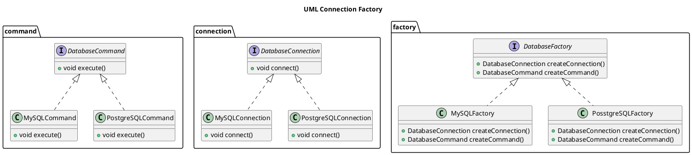

---
export_on_save:
  html: true
---

# Abstract Factory 

## Motivação

Ao desenvolver aplicações que suportam múltiplos bancos de dados, é comum enfrentar o problema de dependência direta de um banco específico, tornando o código rígido e difícil de manter. Cada banco pode ter sua própria forma de conexão e execução de comandos SQL, exigindo ajustes manuais ao trocar de tecnologia. O padrão Abstract Factory resolve esse problema ao desacoplar a criação dos objetos responsáveis pela conexão e execução de comandos, permitindo que a aplicação funcione de forma genérica, criando instâncias apropriadas conforme o banco de dados selecionado. Isso facilita a manutenção, melhora a escalabilidade e permite que a aplicação suporte novos bancos sem modificar seu código principal.

## Membros 

### `DatabaseFactory` (Interface)
- Define métodos para criar **conexões** e **comandos SQL**.
- Implementada por fábricas concretas para cada banco de dados.

### `MySQLFactory` e `PostgreSQLFactory` (Classes concretas)
- Implementam `DatabaseFactory`, criando objetos específicos para **MySQL** e **PostgreSQL**.
- Retornam instâncias das classes:
  - `MySQLConnection`
  - `MySQLCommand`
  - `PostgreSQLConnection`
  - `PostgreSQLCommand`

### `DatabaseConnection` (Interface)
- Define o método `connect()`, padronizando a forma como os bancos realizam conexões.

### `MySQLConnection` e `PostgreSQLConnection` (Classes concretas)
- Implementam `DatabaseConnection`, cada uma realizando a conexão com seu respectivo banco.

### `DatabaseCommand` (Interface)
- Define `execute(String query)`, permitindo que comandos SQL sejam executados.

### `MySQLCommand` e `PostgreSQLCommand` (Classes concretas)
- Implementam `DatabaseCommand`, adaptando a execução de queries para cada banco.

### `AbstractFactoryDatabaseExample` (Classe Cliente)
- **Depende apenas de `DatabaseFactory`** para criar conexões e comandos.
- Pode **trocar dinamicamente** de banco apenas instanciando uma fábrica diferente.
